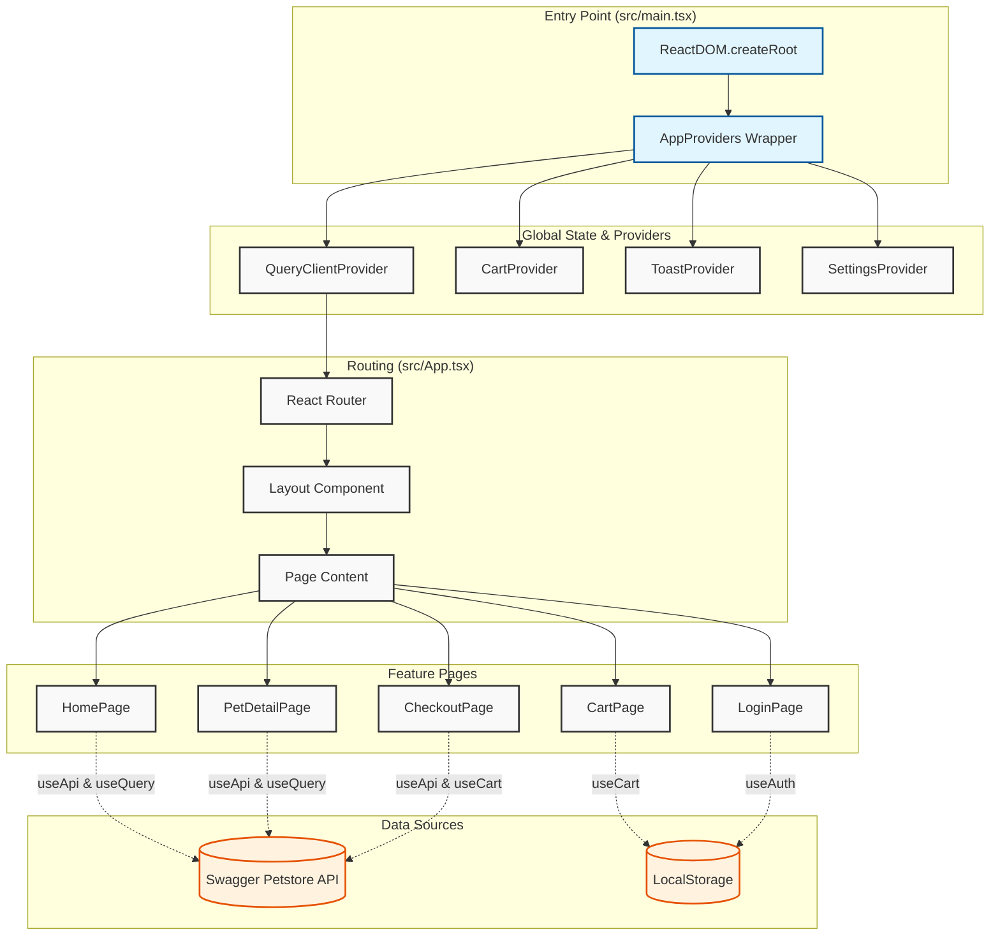

# Application Architecture & Data Flow

This document provides a visual overview of the application's entry point and data flow to help new developers understand how the pieces fit together.

## 🗺️ High-Level Architecture

The application follows a standard React Single Page Application (SPA) flow.

## 🔄 Detailed Data Flow Scenarios

### 1. Application Initialization
1.  **`src/main.tsx`**: The entry point. It finds the root DOM element and renders the `App` component wrapped in `AppProviders`.
2.  **`AppProviders`**: Initializes the global context providers:
    -   **QueryClientProvider**: Sets up React Query for caching API requests.
    -   **CartProvider**: Hydrates the shopping cart from `localStorage`.
    -   **ToastProvider**: Sets up the notification system.
3.  **`App.tsx`**: Defines the routes. Based on the URL, it renders the appropriate page component inside the `Layout`.

### 2. Fetching & Displaying Pets (HomePage)
1.  **Component Mount**: `HomePage` mounts.
2.  **Hook Execution**: Calls `useQuery` with a key like `['pets', status]`.
3.  **API Call**: The query function uses `client.GET('/pet/findByStatus')` (from `openapi-fetch`).
4.  **Data Processing**:
    -   Response is validated against the generated schema.
    -   `getPetImage` and `getPetPrice` (utils) add missing visual data.
    -   `Number.isSafeInteger` filters out invalid IDs.
5.  **Rendering**: The `PetGrid` renders the list of pets.

### 3. Adding to Cart
1.  **User Action**: User clicks "Add to Cart" on a `PetCard`.
2.  **Context Update**: `useCart` hook's `addToCart` function is called.
3.  **State Change**: The `CartContext` state updates, adding the item.
4.  **Persistence**: The `CartProvider`'s `useEffect` detects the state change and writes the new cart to `localStorage`.
5.  **UI Feedback**: The Header cart counter updates automatically (reactively).

### 4. Checkout Process
1.  **User Action**: User submits the form on `CheckoutPage`.
2.  **Validation**: Zod schema validates the input fields.
3.  **Mutation**: `useMutation` triggers the `placeOrder` API call.
4.  **Optimistic/Side Effects**:
    -   On success, `clearCart()` is called.
    -   User is redirected to success page or shown a success toast.
    -   Queries might be invalidated to refresh order history (if implemented).
